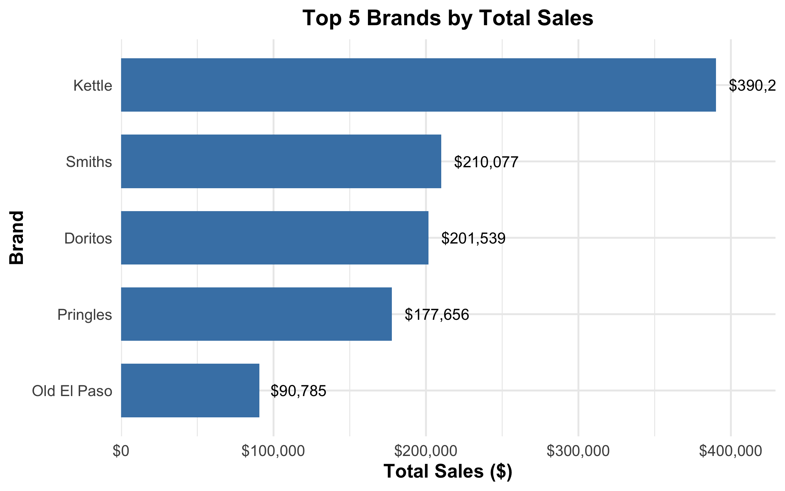
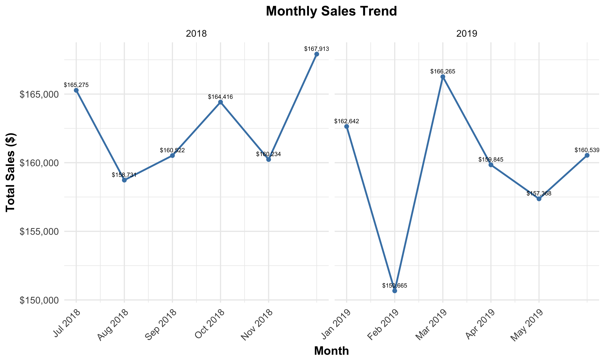
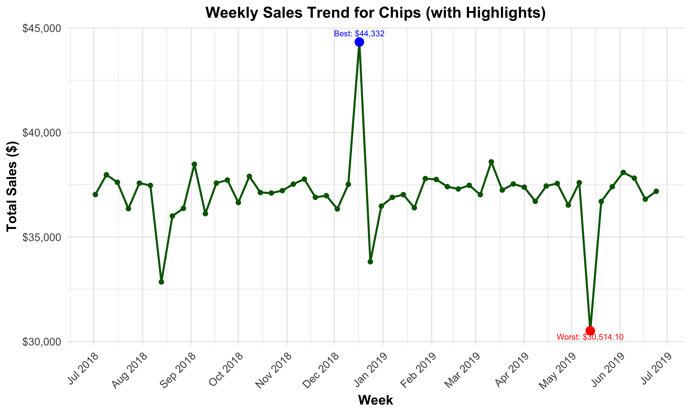
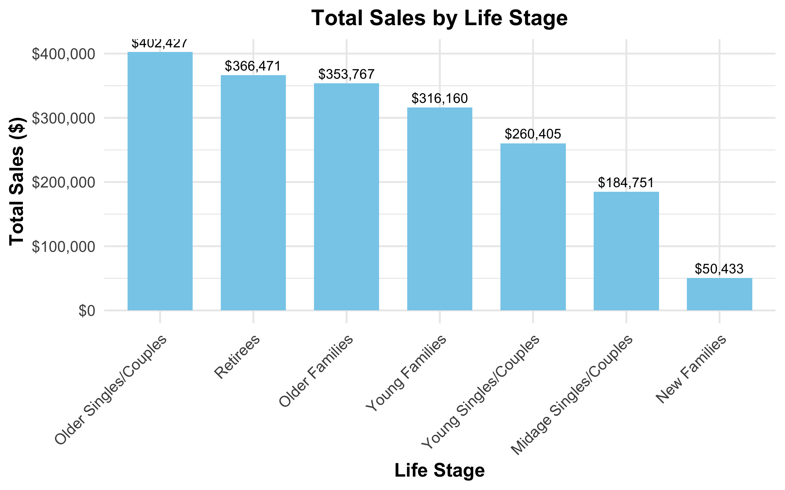
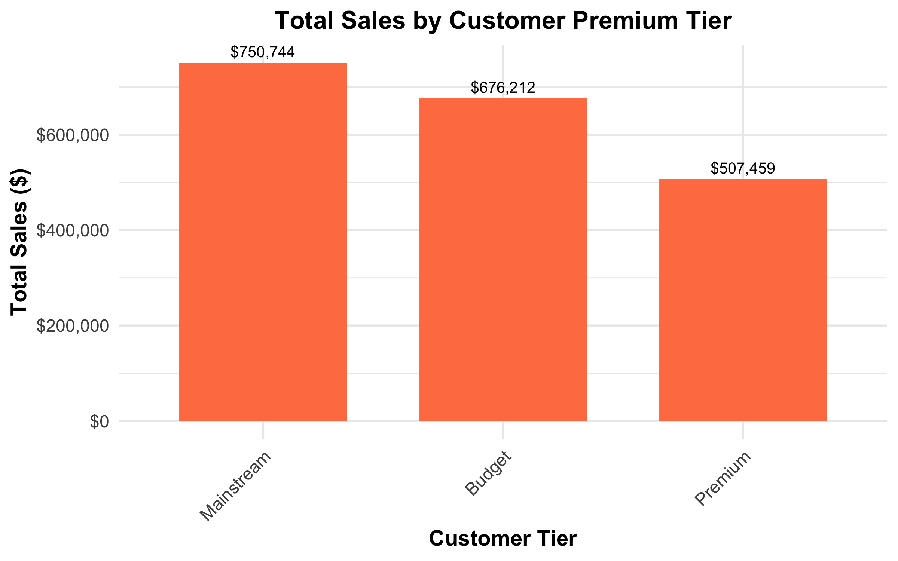

\newpage
\thispagestyle{empty}

\begin{center}
\vspace*{3cm}

{\LARGE \textbf{Quantium Chip Sales Analysis Report}}\\[1.5cm]

{\large Prepared for}\\[0.3cm]
{\Large \textbf{Quantium Category Management Team}}\\[2cm]

{\large Author: Tianyi Sun}\\[0.5cm]
{\large Date: \today}\\

\vfill

%\includegraphics[width=0.3\textwidth]{outputs/charts/logo.png}  % 

\end{center}

\newpage

```{r setup, include=FALSE}
library(tidyverse)
library(scales)
library(here)
library(zoo)
library(readr)

# Load your summary files
weekly_sales <- read_csv(here("summaries", "weekly_sales.csv"))
monthly_sales <- read_csv(here("summaries", "monthly_sales.csv"))
sales_by_brand <- read_csv(here("summaries", "sales_by_brand.csv"))
sales_by_lifestage <- read_csv(here("summaries", "sales_by_lifestage.csv"))
sales_by_premium <- read_csv(here("summaries", "sales_by_premium.csv"))

# Format your date columns
weekly_sales$WEEK_START <- as.Date(weekly_sales$WEEK_START)
monthly_sales$YEAR_MONTH <- as.yearmon(monthly_sales$YEAR_MONTH, "%Y-%m")

```

# Executive Summary
This report explores chip sales data across customer segments and time, using merged transaction and customer behavior data. The analysis reveals which brands, timeframes, and demographics drive revenue for Quantium's chip category.

# Key Insights

## Top 5 Brands by Total Sales
Kettle leads with $403,588, followed by Smiths ($273,778), Doritos ($267,806), Pringles ($221,438), and Old El Paso ($91,615).

## Monthly Sales Trends
Strongest month: December 2018, with total sales of $170,786.
Lowest month: June 2018 (partial month), with only $27,358.

Overall sales trend is relatively stable with peaks during holiday months (November–December) and small dips mid-year.

## Customer Premium Segments
Mainstream customers generate the highest revenue: $750,744 (approximately 39% of total).
Budget segment contributes $676,212, while Premium accounts for $507,459.

Total across segments: $1.93 million.

## Customer Life Stages
Top 3 life stages by total sales:
Older Singles/Couples: $402,427
Retirees: $366,471
Older Families: $353,767
Lowest spenders are New Families at $50,433.

## Weekly Sales Pattern
Weekly sales average: approximately $37,200.
Highest weekly sales: $44,332 (December 23–29, 2018).
Lowest weekly sales: $30,514 (June 4–10, 2018), likely due to partial data.


# Data Visualizations

## Top 5 Brands by Total Sales

```{r}

```
## Monthly Sales Trends

```{r}

```
## Weekly Sales Trend

```{r}

```
## Sales by Life Stage

```{r}

```

## Sales by Customer Premium Tier

```{r}

```

# Conclusion
Based on the analysis, mainstream customers and holiday months (November–December) present the strongest revenue opportunities. Targeted marketing toward older demographic life stages and premium segment promotions could significantly boost future chip category sales.

# Appendix
Data source: Quantium transaction and customer data
Analysis conducted using R, ggplot2, and RMarkdown
Report prepared by Tianyi Sun

